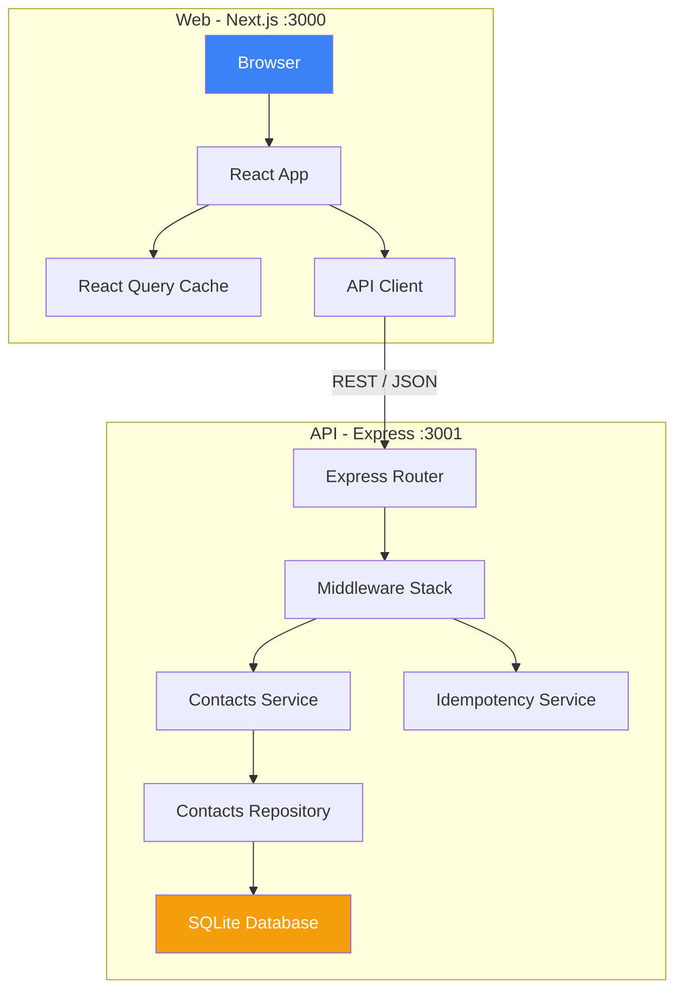
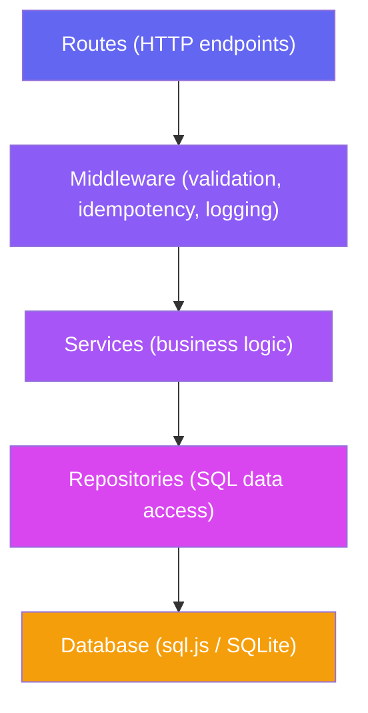
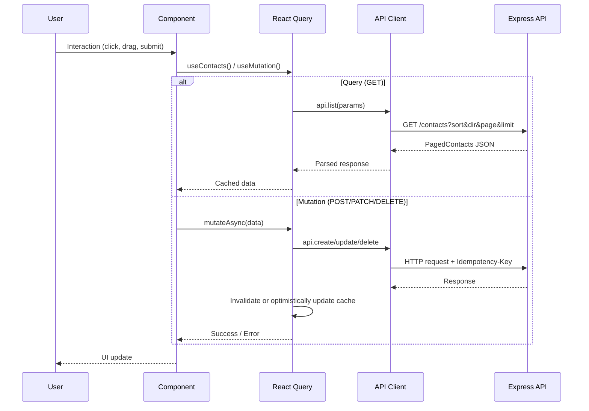
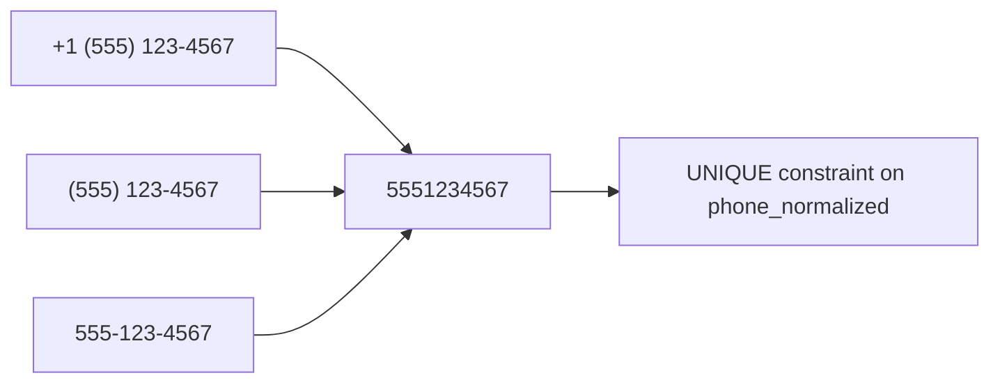
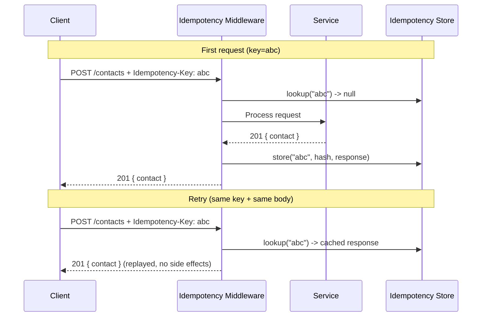
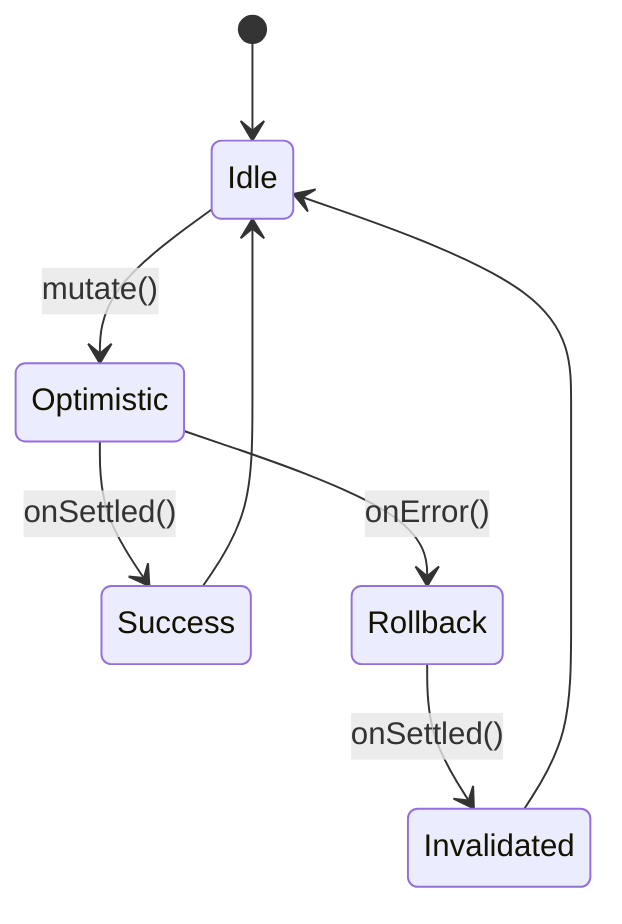
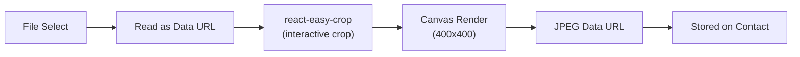

# Contacts Manager

A full-stack contacts management application with a **REST API** backend and a modern **React** frontend. Built with clean architecture, type safety, and production-ready patterns.

---

## Table of Contents

- [Overview](#overview)
- [Tech Stack](#tech-stack)
- [Architecture](#architecture)
- [API Reference](#api-reference)
- [Getting Started](#getting-started)
- [Project Structure](#project-structure)
- [Key Features](#key-features)
- [Testing](#testing)

---

## Overview

This project is a contacts management system split into two independent applications that communicate via a REST API:

| Project | Directory | Port | Description |
|---------|-----------|------|-------------|
| **API** | `api/` | 3001 | Express.js REST API with SQLite storage |
| **Web** | `web/` | 3000 | Next.js single-page application |

---

## Tech Stack

### API (`api/`)

| Technology | Purpose |
|-----------|---------|
| **Express 5** | HTTP server and routing |
| **sql.js** | WebAssembly-based SQLite (no native deps) |
| **Zod** | Runtime validation and type inference |
| **Pino** | Structured JSON logging |
| **OpenAPI 3.1** | Auto-generated API documentation via `zod-to-openapi` |
| **Scalar** | Interactive API docs UI at `/docs` |
| **Vitest** | Test runner (unit + E2E) |

### Web (`web/`)

| Technology | Purpose |
|-----------|---------|
| **Next.js 16** | React framework (App Router) |
| **React 19** | UI library |
| **TanStack React Query** | Server state management with optimistic updates |
| **React Hook Form + Zod** | Form handling and validation |
| **shadcn/ui (base-nova)** | Component library built on `@base-ui/react` |
| **Tailwind CSS 4** | Utility-first styling with OKLCH color system |
| **dnd-kit** | Drag-and-drop reordering |
| **react-easy-crop** | Contact photo cropping |
| **Sonner** | Toast notifications |

---

## Architecture

### High-Level System Diagram



### API Layered Architecture

The API follows a strict **layered architecture** where each layer has a single responsibility:



| Layer | Responsibility | Key Pattern |
|-------|---------------|-------------|
| **Routes** | HTTP endpoint definitions, middleware wiring | Dependency injection via factory function |
| **Middleware** | Request validation, idempotency, error handling, logging | Zod-based validation with `safeParse` |
| **Services** | Business rules, error translation, side effects | Injectable `now()`, `genId()`, `persist()` |
| **Repositories** | SQL queries, row mapping, pagination | Snake_case to camelCase mapping |
| **Database** | Schema, migrations, persistence | sql.js in-memory + explicit `persist()` |

### Web Data Flow



---

## API Reference

Interactive documentation is available at `http://localhost:3001/docs` (Scalar UI).

### Endpoints

| Method | Endpoint | Description |
|--------|----------|-------------|
| `GET` | `/health` | Health check |
| `GET` | `/contacts` | List contacts (paginated, sortable) |
| `POST` | `/contacts` | Create a contact |
| `GET` | `/contacts/:id` | Get a single contact |
| `PATCH` | `/contacts/:id` | Update a contact |
| `DELETE` | `/contacts/:id` | Delete a contact |
| `PUT` | `/contacts/reorder` | Reorder contacts (batch) |

### Query Parameters (GET /contacts)

| Param | Type | Default | Description |
|-------|------|---------|-------------|
| `sort` | `sortOrder` \| `name` \| `createdAt` | `sortOrder` | Sort field |
| `dir` | `asc` \| `desc` | `asc` | Sort direction |
| `page` | number | `1` | Page number |
| `limit` | number | `100` | Items per page (max 500) |

### Idempotency

State-changing operations (`POST`, `PATCH`) support an optional `Idempotency-Key` header. Replaying the same request with the same key returns the original response without creating duplicates. Different body + same key returns `422`. Keys expire after 24 hours (configurable).

---

## Getting Started

### Prerequisites

- **Node.js** >= 18
- **npm** >= 9

### 1. Clone and install

```bash
# Install API dependencies
cd api
npm install

# Install Web dependencies
cd ../web
npm install
```

### 2. Environment variables

The **Web** app needs a `.env.local` file in `web/` (Next.js auto-loads it):

```bash
# web/.env.local
NEXT_PUBLIC_API_URL=http://localhost:3001
```

The **API** reads environment variables directly from `process.env` (validated via Zod at startup). If you need to override defaults, set them in your shell or system environment.

The API server reads these defaults automatically:

| Variable | Default | Description |
|----------|---------|-------------|
| `PORT` | `3001` | API server port |
| `HOST` | `0.0.0.0` | API bind address |
| `DB_PATH` | `./data/contacts.sqlite` | SQLite database path |
| `LOG_LEVEL` | `info` | Pino log level |
| `IDEMPOTENCY_TTL_HOURS` | `24` | Idempotency key expiration |

### 3. Start the API

```bash
cd api
npm run dev        # Development (tsx watch with hot-reload)
```

### 4. Seed the database (optional)

```bash
cd api
npm run seed           # Create 200 random contacts
npm run seed:reset     # Clear and reseed
```

### 5. Start the Web app

```bash
cd web
npm run dev        # Development server on http://localhost:3000
```

Open [http://localhost:3000](http://localhost:3000) in your browser.

---

## Project Structure

```
app/
├── .env.example                # Environment variable template
├── .gitignore
├── README.md
│
├── api/                        # Backend - Express REST API
│   ├── src/
│   │   ├── index.ts            # Entry point, server bootstrap, graceful shutdown
│   │   ├── app.ts              # App factory (Express setup + dependency wiring)
│   │   ├── openapi.ts          # OpenAPI 3.1 spec generation from Zod schemas
│   │   ├── config/
│   │   │   └── env.ts          # Zod-validated environment config
│   │   ├── db/
│   │   │   ├── connection.ts   # sql.js database lifecycle (open, migrate, persist)
│   │   │   └── schema.sql      # DDL (contacts + idempotency_keys tables)
│   │   ├── domain/
│   │   │   └── contact.ts      # Zod schemas (shared contract layer)
│   │   ├── lib/
│   │   │   ├── errors.ts       # Error hierarchy (AppError, NotFoundError, etc.)
│   │   │   └── phone.ts        # Phone number normalization
│   │   ├── middleware/
│   │   │   ├── error-handler.ts    # Centralized error-to-JSON middleware
│   │   │   ├── idempotency.ts      # Stripe-style idempotency key middleware
│   │   │   ├── logger.ts           # Pino + pino-http setup
│   │   │   └── validate.ts         # Generic Zod validation middleware
│   │   ├── repositories/
│   │   │   └── contacts.repo.ts    # Data access layer (raw SQL)
│   │   ├── routes/
│   │   │   └── contacts.route.ts   # Express router (endpoint definitions)
│   │   └── services/
│   │       ├── contacts.service.ts # Business logic layer
│   │       └── idempotency.service.ts # Idempotency key storage & lookup
│   ├── scripts/
│   │   └── seed.ts             # Database seeder (random contacts)
│   ├── test/
│   │   ├── e2e/                # End-to-end HTTP tests (supertest)
│   │   ├── unit/               # Unit tests (service, repo, idempotency)
│   │   └── helpers/            # Test utilities (in-memory DB factory)
│   ├── vitest.config.ts
│   ├── tsconfig.json
│   └── package.json
│
└── web/                        # Frontend - Next.js SPA
    ├── src/
    │   ├── app/
    │   │   ├── layout.tsx      # Root layout (fonts, providers, metadata)
    │   │   ├── page.tsx        # Main page (orchestrator component)
    │   │   ├── providers.tsx   # React Query + Sonner Toaster
    │   │   └── globals.css     # Tailwind v4 theme (OKLCH colors, dark mode)
    │   ├── components/
    │   │   ├── contacts/
    │   │   │   ├── contacts-grid.tsx        # Grid with drag-and-drop (dnd-kit)
    │   │   │   ├── contact-card.tsx         # Sortable contact card
    │   │   │   ├── contact-detail-sheet.tsx # Edit contact (right sheet)
    │   │   │   ├── contact-about-dialog.tsx # View contact details (dialog)
    │   │   │   ├── contact-action-sheet.tsx # Context menu (bottom sheet)
    │   │   │   ├── new-contact-sheet.tsx    # Create contact (right sheet)
    │   │   │   ├── delete-contact-dialog.tsx # Delete confirmation (dialog)
    │   │   │   ├── photo-picker.tsx         # Photo upload/remove UI
    │   │   │   ├── photo-cropper-dialog.tsx # Crop photo (react-easy-crop)
    │   │   │   ├── sort-menu.tsx            # Sort mode dropdown
    │   │   │   ├── pagination-bar.tsx       # Prev/next pagination
    │   │   │   ├── empty-state.tsx          # No-contacts placeholder
    │   │   │   └── contacts-skeleton.tsx    # Loading skeleton grid
    │   │   └── ui/             # shadcn/ui components (base-nova)
    │   └── lib/
    │       ├── api.ts          # HTTP client (fetch wrapper)
    │       ├── queries.ts      # React Query hooks + optimistic updates
    │       ├── types.ts        # TypeScript type definitions
    │       ├── phone.ts        # US phone formatting
    │       ├── initials.ts     # Avatar initials extraction
    │       ├── crop-image.ts   # Canvas-based image cropping
    │       └── utils.ts        # Tailwind class merging (cn)
    ├── next.config.ts
    ├── components.json         # shadcn/ui configuration
    ├── tsconfig.json
    └── package.json
```

---

## Key Features

### Phone Number Deduplication

Raw phone numbers are stored for display, but a **normalized** version (digits only, US country code stripped) is stored in a separate column with a partial unique index. This means `+1 (555) 123-4567` and `5551234567` are recognized as the same number.



### Stripe-Style Idempotency

State-changing requests accept an `Idempotency-Key` header to prevent duplicate operations on retry:



### Optimistic Updates

The frontend uses React Query optimistic updates for **delete** and **reorder** operations, providing instant UI feedback with automatic rollback on error:



### Drag-and-Drop Reordering

Contacts can be manually reordered via drag-and-drop (enabled in "Manual order" sort mode). Uses `@dnd-kit` with pointer, touch, and keyboard sensors for cross-device support.

### Photo Cropping Pipeline



---

## Testing

### API Tests

```bash
cd api

# Run all tests
npm test

# Run only unit tests
npm run test:unit

# Run only E2E tests
npm run test:e2e

# Watch mode
npm run test:watch
```

The test suite includes:
- **Unit tests** -- Repository, Service, and Idempotency layers tested in isolation with dependency injection
- **E2E tests** -- Full HTTP stack tests using `supertest` with in-memory SQLite, covering CRUD, pagination, sorting, reorder, photos, idempotency, and phone deduplication

### Web Linting

```bash
cd web
npm run lint
```
